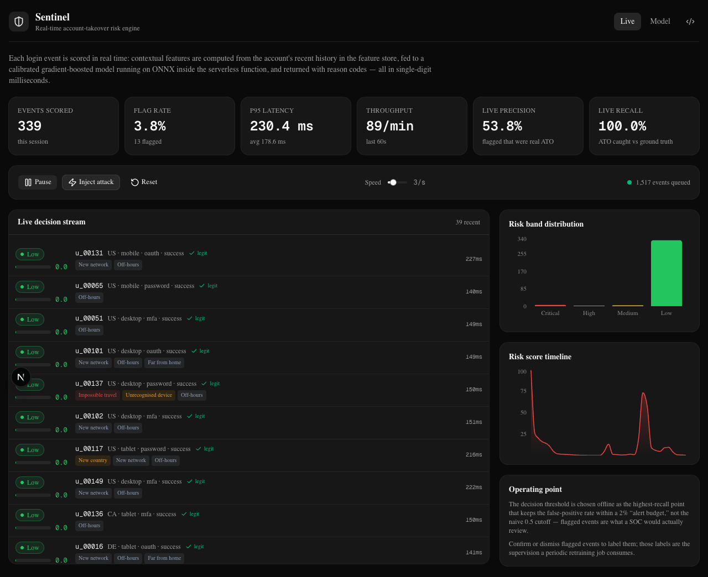
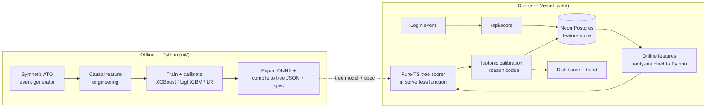
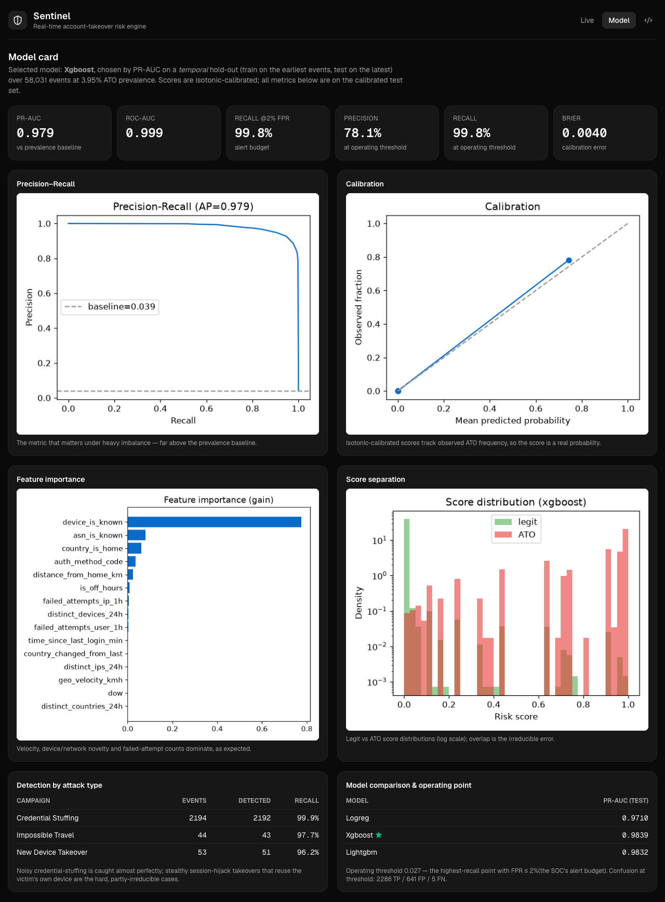

# Sentinel — Real-Time Account-Takeover Risk Engine

Sentinel scores authentication events for account-takeover (ATO) risk **in real time**: every
login is turned into contextual features from the account's recent history, scored by a calibrated
gradient-boosted model, and returned with a risk band and human-readable reason codes — in
single-digit milliseconds, with no separate model server.

**Live demo: [sentinel-risk-engine.vercel.app](https://sentinel-risk-engine.vercel.app)** · the whole
thing runs on one free Vercel deployment + a serverless Postgres feature store. Press **Start stream**
to watch login events get scored in real time, or **Inject attack** to fire an obvious takeover.



---

## Why this project

It's built to mirror the work of an ML engineer on a trust & safety / core-security team — framing a
security problem as an ML task, engineering features from auth signals, handling severe class
imbalance, calibrating and thresholding for a real operating constraint, deploying the model to
production, and closing the feedback loop:

| What the work looks like | Where it is in this repo |
| --- | --- |
| Frame a security problem as an ML task | Synthetic ATO campaigns → labelled login stream ([`ml/sentinel_ml/generate.py`](ml/sentinel_ml/generate.py)) |
| Feature-engineer from logs & contextual signals | Causal, point-in-time features ([`ml/sentinel_ml/features.py`](ml/sentinel_ml/features.py)) |
| Tree-based models + classical baseline | XGBoost / LightGBM / logistic regression ([`ml/sentinel_ml/train.py`](ml/sentinel_ml/train.py)) |
| Imbalanced data, real-time decisions | PR-AUC, calibration, FPR-budget threshold; sub-ms inference |
| Deploy & maintain a production pipeline | Compiled tree model served from a Vercel function, zero native deps ([`web/src/lib/scoring/`](web/src/lib/scoring)) |
| Feedback loops & iterative retraining | Analyst labels → retraining supervision ([feedback API](web/src/app/api/feedback/route.ts)) |

All data is **synthetic and generated locally** — no real user data is involved.

---

## How it works



**The model is trained in Python and served in TypeScript.** The gradient-boosted model is exported
to ONNX (a parity-checked, portable artifact) and also compiled to a compact JSON of decision trees
that a **zero-dependency TypeScript scorer** walks inside the serverless function — no native module,
no wasm, a tiny bundle that runs anywhere. The entire feature contract (ordered features, categorical
encodings, clip bounds, calibration table, operating threshold) is serialized to `feature_spec.json`,
both sides import that one file, and a [parity check](web/scripts/parity-check.ts) asserts the
TypeScript serving path reproduces the Python pipeline to within **1e-6** — so there is no
train/serve skew.

**Features are computed online from the feature store.** At score time Sentinel reads the account's
recent events and the source IP's recent failures from Postgres and derives the same point-in-time
features used in training — geo-velocity, device/network novelty, failed-attempt counts, country
spread, time-since-last-login. This is the "feature store + online inference" shape of a production
risk system, in miniature.

---

## Results

Calibrated XGBoost on a **temporal** hold-out (train on the earliest events, test on the latest;
never a random split, which would leak the future):

| Metric | Value | Why it matters |
| --- | --- | --- |
| PR-AUC | **0.979** | The right headline metric at ~3% prevalence (accuracy is meaningless here) |
| ROC-AUC | 0.999 | — |
| Recall @ 2% FPR | **0.998** | Recall under a fixed SOC "alert budget" |
| Precision @ threshold | 0.78 | At the chosen operating point |
| Brier score | 0.004 | Scores are calibrated probabilities, not arbitrary numbers |

Model selection (PR-AUC, temporal test): **XGBoost 0.984** · LightGBM 0.983 · Logistic Regression
0.971 — the gradient-boosted models earn their place over a strong linear baseline.

**Detection is honest about what's hard.** Noisy credential-stuffing is caught almost perfectly;
stealthy session-hijack takeovers that reuse the victim's own device/network are partly
irreducible — and the generator deliberately includes them so the metrics aren't a fiction.



---

## The ML, in more detail

- **Imbalance** (~3% positives): `scale_pos_weight` for trees, balanced class weights for the
  linear baseline; models ranked by PR-AUC, not accuracy.
- **Calibration**: raw GBDT margins aren't probabilities, so an isotonic map is fit on a held-out
  slice and shipped as a 256-point lookup table the serving layer interpolates.
- **Operating threshold**: chosen as the highest-recall point keeping FPR within a 2% alert budget —
  the decision a SOC actually lives with — rather than a naive 0.5 cutoff.
- **Reason codes**: every score ships with transparent, rule-derived explanations (impossible
  travel, new device, credential stuffing, …) so an analyst can action an alert.
- **Feedback loop**: analysts confirm/dismiss flagged events in the dashboard; those labels are
  exactly the supervision a periodic retraining job consumes.

See [`docs/MODEL_CARD.md`](docs/MODEL_CARD.md) and [`docs/DESIGN.md`](docs/DESIGN.md).

---

## Repo layout

```
sentinel-risk-engine/
├─ ml/                      # Python: generation, features, training, ONNX + tree export
│  └─ sentinel_ml/          # uv run sentinel all  →  model_trees.json + feature_spec.json + demo data
├─ web/                     # Next.js app (App Router, TypeScript) deployed on Vercel
│  ├─ src/lib/scoring/      # pure-TS tree scorer + online features (parity-matched to Python)
│  ├─ src/lib/db/           # Drizzle schema for the Neon Postgres feature store
│  ├─ src/app/api/          # /score /feedback /events /stats /seed
│  └─ src/app/              # live dashboard + model card
└─ .github/workflows/ci.yml # ML lint+tests, model parity, web build
```

---

## Run it locally

**1. Train the model (Python, [uv](https://docs.astral.sh/uv/)):**

```bash
cd ml
uv sync
uv run sentinel all     # generate → features → train → export → sync to web → demo data
```

**2. Run the app (Node 20 + pnpm):**

```bash
cd web
pnpm install
cp .env.example .env.local      # set DATABASE_URL to a Postgres instance
pnpm db:migrate                 # create the feature-store schema
pnpm dev                        # http://localhost:3000  → press "Start stream"
```

The TypeScript serving path is verified against the Python pipeline with `pnpm parity`.

---

## Deployment

Deployed on **Vercel** with a **Neon** serverless Postgres feature store (provisioned through the
Vercel Marketplace, so `DATABASE_URL` is injected automatically). The compiled tree model runs in
pure TypeScript inside the serverless function — no native module to bundle, so the function stays
small and cold starts stay fast. Co-located with the database, online scoring is dominated by a
couple of indexed point lookups, not the inference. CI runs the Python tests, the model parity
check, and the production build on every push.

---

_Built by Benjamin Holderbein._
